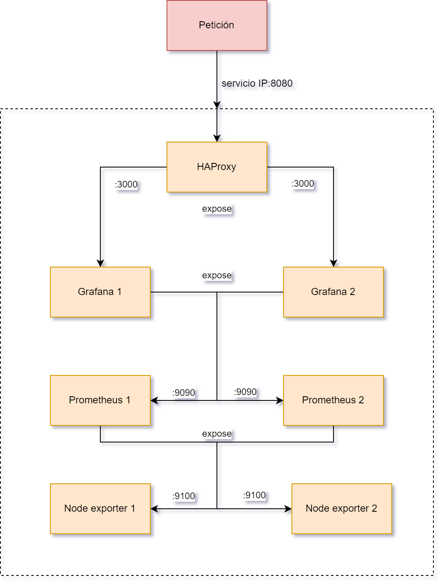
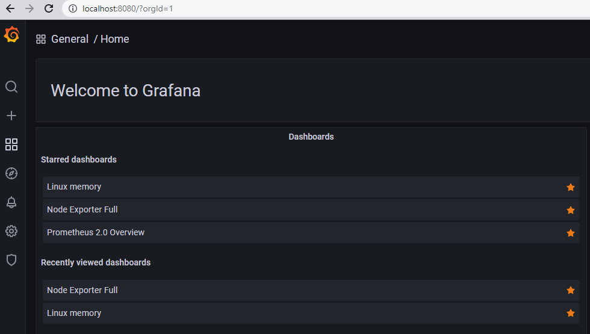

---
## Práctica 1


_Alumno: Diego Hernández Moreno_

_GitHub: [github.com/LCinder](https://github.com/LCinder)_

---

### Descripción de la práctica y problema a resolver

En esta práctica se crearán los archivos de configuración necesarios para 
la orquestación de contenedores, creación de servicios y la habilitación de
un monitoreo constante de los recursos del sistema, atendiendo a las principales
características del _Cloud Computing_ destacando en este caso la escalabilidad
y la disponibilidad.

Para ello se pretende crear varios servicios con diferentes funcionalidades: balanceador
de carga, sistema de monitorización y servicio que muestre todos los datos relativos
al análisis de métricas. Todo organizado correctamente permitirá crear un sistema con varios 
servicios replicados, por lo que si surge algún error como caída de uno de los servicios, 
se pueda mantener un correcto funcionamiento.


---

### Servicios desplegados y su configuración

A continuación se indican los servicios que se han construido para la práctica, así
como sus configuraciones y el nº de servicios creados:
- **Prometheus:** Se trata de un software de código abierto que permite monitorizar,
crear alertas y obtener datos sobre variables de series de tiempo. Las consultas son muy simples, 
flexibles, y los datos son obtenidos a través de peticiones HTTP. Su independencia de cualquier
otro servicio aporta una ventaja muy importante, ya que permite una conexión con otros sistemas
  (como grafana) y nos permite mantener diferentes servicios replicados para mayor disponibilidad.
En esta práctica, se crearán **2 servicios prometheus** para evidenciar que si falla uno de ellos,
se mantiene la fiabilidad del sistema y su funcionamiento.
La configuración de prometheus, entre otros, incluye los sigueintes comandos:
  - `--storage.tsdb.retention.time=7d` que indica el tiempo en el que persisten las métricas
guardadas, en este caso establecido a 7 días. Después de este período se borrarán
  - `--storage.tsdb.no-lockfile` que inhabilita la creación de un archivo `*lock` que hace que falle
  un contenedor cuando se crean réplicas del servicio


Además, se ha hecho necesario crear un volumen para _prometheus-data,_ ya que si se mantenía dentro del contenedor
se obtenía un error con uno de los archivos que prometheus crea por defecto, siendo imposible solucionar el mismo
y que originaba que _prometheus server_ obtuviera un error y se cerrase.

- **Grafana:** Se trata de una plataforma de análisis de métricas para consultar datos,
visualizarlos, compararlos, etc. Se trata también de código abierto, y su funcionalidad
 se ve muy extendida gracias a los múltiples _plugins_ de los que dispone, uno de ellos para 
prometheus, permitiendo crear paneles de visualización de datos y gráficas sobre métricas.
En esta práctica, se crearán **2 servicios grafana** para comprobar que también se permite
 acceder a varias réplicas de este servicio.
La forma de crear réplicas ha sido de la siguiente manera en el `docker-compose.yml`:
```
ports:
      - "3000-3001:3000"
...

deploy:
      replicas: 2
 ```

De esta manera indicamos que se crearán 2 réplicas con la misma configuración indicada en el servicio. 
Sin embargo, se utilizará el mismo puerto, lo que dará error, ya que el puerto ya está escuchando,
por lo que es necesario indicar un rango de puertos relacionado con el nº de réplicas, en este caso el primer
servicio escuchará en el puerto 3000 y el otro servicio en el puerto 3001. Esto se realiza únicamente
cuando se ha querido ver las métricas de grafana. En el caso de pasarlo a producción, se cambia la configuración
de la siguiente manera:
```
expose:
      - "3000"
...

deploy:
      replicas: 2
```

Además, con la intención de no tener que incluir todos los dashboards cada vez que se levantan los servicios, 
se ha creado un volumen para grafana que contiene todos los datos, ya que se han creado los dashboards y luego
se han guardado. Así, cada vez que iniciamos, mantenemos los datos de grafana listos para observar las métricas.

- **Node exporter:** Se trata de un _plugin_ de prometheus (una extensión) que permite obtener 
 datos y métricas del hardware y el sistema operativo. De esta manera, podremos visualizar en 
grafana distintos datos, como la memoria utilizada, ..., etc.
En esta práctica, al igual que en los servicios anteriores, se crearán **2 servicios node-exporter.**

- **HAProxy:** Se trata de un balanceador de carga de código abierto y un proxy inverso para
la distribución de peticiones externas entre varios servidores, permitiendo mantener una infraestructura
libre de errores, cuellos de botella y de esta manera mejorar la eficiencia del sistema.


En la siguiente imagen se muestra la estructura que tiene la composición de servicios creados, 
así como los puertos desde los que se puede acceder:




Los puertos `expose` indican que son internos al contenedor (no accesibles desde fuera) y accesibles
por los diferentes servicios dentro del contenedor. Es decir, únicamente se puede acceder a los servicios desde el puerto
`8080` que realiza una petición a HAProxy y este a su vez accede a Grafana, etc. 


A continuación se muestran diferentes métricas obtenidas por **prometheus** y **node-exporter**
y que pueden ser visualizadas en **grafana.**


Esta métrica proporcionada por **node-exporter** nos muestra distintas informaciones sobre
el hardware, como el porcentaje de CPU ocupada, memoria usada, información sobre la red, etc.


En la siguiente imagen, se muestra la información que proporcionan las métricas propias de **prometheus**
relativas a errores, duración de peticiones HTTP realizadas, trabajos realizados, etc. Muestra
por tanto información relativa al servidor.


En la siguiente figura se muestran distintas métricas, obtenidas también por **node-exporter**
relativas al uso de memoria a través del tiempo. Se muestra mucha información como la pila kernel, uso de buffers,
memoria libre, etc. así como la capacidad de la memoria total existente, lo que nos permite monitorizar
completamente la memoria del sistema.


Se han seleccionado estas métricas, pero se podrían haber elegido multitud de _plugins_ ya que
la cantidad de métricas a obtener y mostrar es muy elevada y es constantemente actualizada.


En la siguiente imagen se muestra cómo HAProxy funciona, permitiendo mostrar unas estadísticas sobre
los servicios en ejecución (en este caso los 2 grafanas) e indicando su estado de funcionamiento.


Además vemos cómo si accedemos a `lcoalhost:8080` es decir, al puerto configurado para HAProxy, 
nos muestra la interfaz de grafana, por lo que el funcionamiento es correcto.





La configuración de `haproxy.cfg` es la siguiente:

```

global
    debug
    maxconn 2000

defaults
    ...
    mode http


frontend frontend
    bind *:80
    default_backend d_backend
    stats enable
    stats uri /stats
    stats admin if LOCALHOST

backend d_backend
    mode http
    balance roundrobin
    option httpchk
    server grafana1 grafana:3000 check
    server grafana2 grafana:3000 check
```


Donde se ha establecido un frontend donde se mostrarán las estadísticas de las figuras anteriores.
Para el backend, se establece el modo de acceso a http necesario para que funcione, y se indican
los 2 servidores para grafana, con el dominio y el puerto específicos

El comando para levantar los servicios es: `docker-compose up --build`
Se ha utilizado únicamente `docker-compose` debido a su sencillez en la creación de servicios
y en la configuración de los mismos. Las opciones `option httpchk` y `check` son comprobaciones
de que se puede realizar el acceso, ya que puede haber error de conexiones rechazadas en la capa L4 (de transporte)
del firewall que proporciona HAProxy.


---

### Conclusiones

Como conclusión al trabajo realizado se ha detectado la importancia de una buena configuración
de los servicios a crear, siendo necesario un estudio previo de los diferentes comandos posibles a incluir,
además de entender diferentes propiedades de los servicios a priori con funcionalidades muy parecidas, como `ports`
y `expose.` 

Además se ha entendido qué es un balanceador de carga, la importancia que tiene en temas de seguridad,
 su configuración, etc. En cuanto a las métricas, se ha entendido pará qué es necesario diferentes servicios como
grafana o node-exporter y su utilidad a la hora de monitorizar un sistema.

Como conclusión final se obtiene que es necesario crear y configurar sistemas con disponibilidad,
fiables, y atender a las necesidades del mismo observando y midiendo sus métricas para poder garantizar
las propiedades del _Cloud Computing._