---
## Práctica 2: Serverless

Diego Hernández Moreno

GitHub: [github.com/LCinder/CC2/Practica2](https://github.com/LCinder/CC2/tree/master/Practica%202)
***


En esta práctica se configurará **OpenFaaS** para la creación de un servicio serverless con el que se construirán 
funciones, en este caso una función en python en donde para una imagen dada, se reconocerán las caras
de esa imagen. Se ha realizado en el SO Windows 10 (con extra de dificultad) además de utilizar Docker 
y Kubernetes para su funcionamiento, en concreto minikube.
A continuación se explican los pasos realizados.

Después de intentar instalar varias veces microk8s, ya que su instalación en Windows es toda una odisea, e intentarlo
también con multipass (gestor de VM en Windows) y obtener 1000 errores también, se decidió optar por otra vía para 
tener Kubernetes en local mediante la instalación de minikube, el cuál permite crear un clúster de Kubernetes local 
sin necesitar de un servidor.

Antes de nada es necesario instalar las dependencias necesarias: como ya hemos dicho se necesita **minikube**
además de otras como el cliente de kubernetes, 
el gestor de paquetes de kubernetes **Helm**, y el cliente de OpenFaaS llamado **faas-cli** 
y por último **Git** y **Docker** si no estaban instalados. En Windows se realiza con 
**chocolatey** que se trata de un gestor de paquetes para este SO.
Por tanto realizamos desde la powershell ejecutada como administrador `choco install <paquetes>`

Una vez realizado todo comprobamos que el cliente **faas-cli** funciona correctamente:

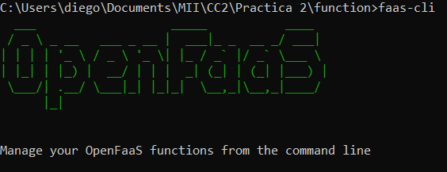


Como existen comandos que no se reconocen, hay que añadirlos como PATH a las variables de entorno del sistema.

Para instalar **OpenFaaS** clonaremos su [repositorio](https://github.com/openfaas/faas-netes) desde Git.
Una vez posicionados en la nueva carpeta, usaremos Helm para instalar OpenFaaS por defecto mediante el 
comando `helm upgrade --install --debug --reset-values --set async=false --set rbac=false openfaas openfaas`

Luego creamos un _namespaces_ identificar a  Open FaaS y añadimos este al repositorio de Helm:
```
kubectl apply -f https://raw.githubusercontent.com/openfaas/faas-netes/master/namespaces.yml
helm repo add openfaas https://openfaas.github.io/faas-netes/
```


Creamos un usuario admin para identificarnos en OpenFaaS:

`kubectl -n openfaas create secret generic basic-auth --from-literal=basic-auth-user=admin --from-literal=basic-auth-password="admin"`


Una vez realizado todo esto, podremos inicializar minikube de forma:
`minikube start`


Pero hay un error: cuando accedemos a localhost nos deniega la conexión ¿Por qué? Esto es debido a que el puerto está
accesible dentro del contenedor, por lo que si queremos acceder desde nuestra máquina es necesario _mapear_ los puertos y hacerlos
accesibles localmente: `kubectl port-forward -n openfaas svc/gateway 8080:8080`

De esta manera ya sí podemos acceder a [localhost](localhost:8080) y nos solicita el usuario y contraseña creada en pasos anteriores

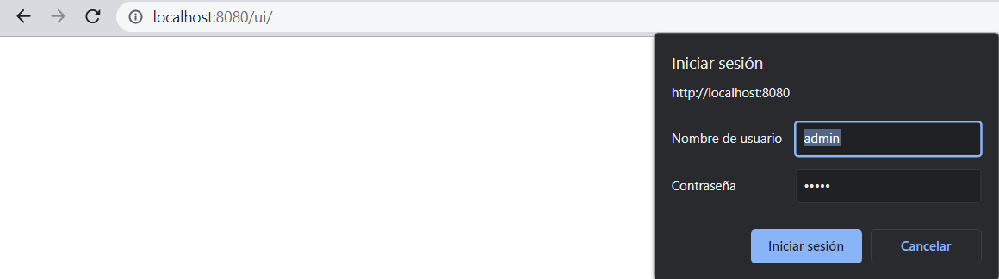


Una vez iniciada la sesión, todo debería funcionar correctamente:

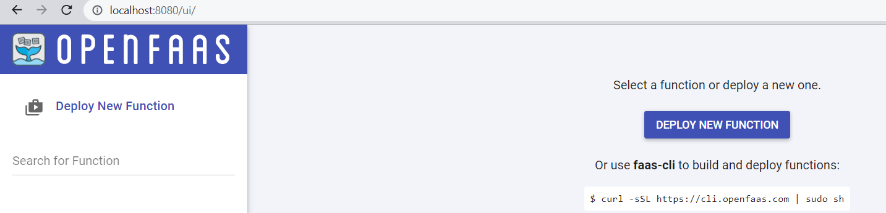


---

### Creación y Despliegue de Funciones 

Ahora llega el turno de crear las funciones que queramos y después desplegarlas para que sean accesibles mediante 
peticiones HTTP.


Para ello tendremos que realizar 3 logins diferentes (al menos en Windows es necesario realizarlo así):
- Iniciar sesión en Docker mediante `docker login`
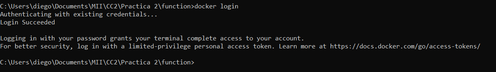

- Iniciar sesión en GHCR (GitHub Container Registry) para realizar los _push_ y _deploys_
Para ello hay que generar un TOKEN en GitHub que nos permita realizar un login mediante credenciales:
`echo %TOKEN% | docker login ghcr.io -u lcinder --password-stdin`
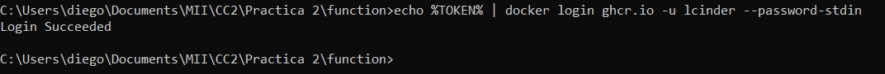

- Por último, iniciar sesión en **faas-cli** con el mismo usuario creado para OpenFaaS ya que necesitamos permisos 
para desplegar las funciones. 
Esto se hace mediante `echo %pass% | faas-cli login -u admin --password-stdin`:
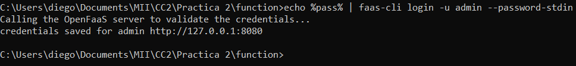

Después de logearnos en todos estos sitios, ya podemos crear las funciones.


Para ello nos descargamos los _templates_ de las funciones, que incluyen los diferentes lenguajes posibles:

`faas-cli template store pull python3`

En este caso utilizaremos python para crear la función. 
Creamos una nueva función de la forma:
`faas-cli new --lang python facesdetection-python`

Lo que nos creará diferentes archivos: un `requirements.txt` un archivo python llamado `handler.py` 
donde definiremos la función y un archivo de tipo `.yml`
para realizar el build y su despliegue.

Definimos la función:

```
import base64

import cv2
import numpy
import requests


def handle(req):
    """handle a request to the function
    Args:
        req (str): request body
    """

    # Load the cascade Classifier
    face_cascade = cv2.CascadeClassifier(cv2.data.haarcascades + 'haarcascade_frontalface_default.xml')
    # Read the input image
    img = requests.get(req).content
    image = numpy.frombuffer(img, numpy.uint8)
    img = cv2.imdecode(image, cv2.COLOR_BGR2GRAY)
    # Detect faces
    faces = face_cascade.detectMultiScale(img, 1.1, 4)
    # Draw rectangle around the faces
    for (x, y, w, h) in faces:
        cv2.rectangle(img, (x, y), (x + w, y + h), (255, 0, 0), 2)
    # Display the output
    cv2.imshow('img', img)
    cv2.imwrite("image.png", img)

    with open("image.png", "rb") as f:
        image_final = base64.b64encode(f.read()).decode("utf-8")

    return f''
```

Se ha utilizado la plantilla dada para la práctica, pero se han modificado algunas partes:
En este caso se le pasa  como argumento una url que corresponde a la dirección de una imagen, a la cuál
se le realiza un **GET** para obtenerla y representarla en **cv2**, que obtiene las caras de esa imagen y devuelve la
imagen en el mismo formato que la imagen de entrada. Posteriormente se codificará la imagen
en base64 y se pasará al estándar utf-8 para estar en el formato adecuado, ya que se enviará
como respuesta la imagen para poder ser visualizada tanto en el navegador como en Postman.

Una vez realizado esto, es hora de desplegar la función. Para ello hay que realizar 3 pasos:
- **Build:** `faas-cli build -f facesdetection-python2.yml`
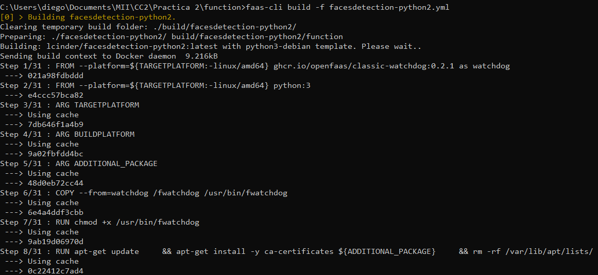
- **Push:** `faas-cli push -f facesdetection-python2.yml`
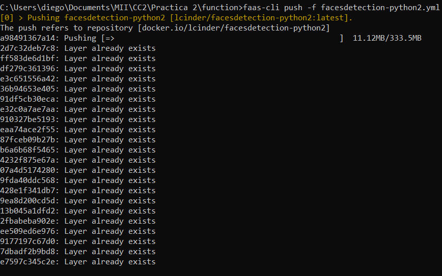
- **Deploy:** `faas-cli deploy -f facesdetection-python2.yml`
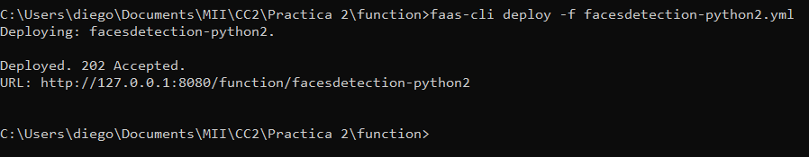


De esta manera se nos habrá creado una instancia en OpenPaaS de esa función:
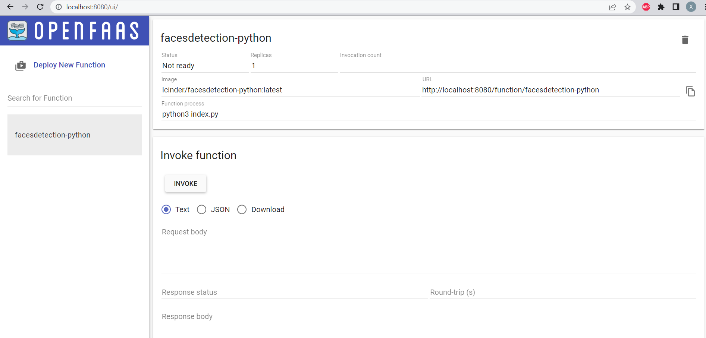


Ahora ya le podemos pasar una URL para que detecte las caras de la imagen pasada en el _body_:
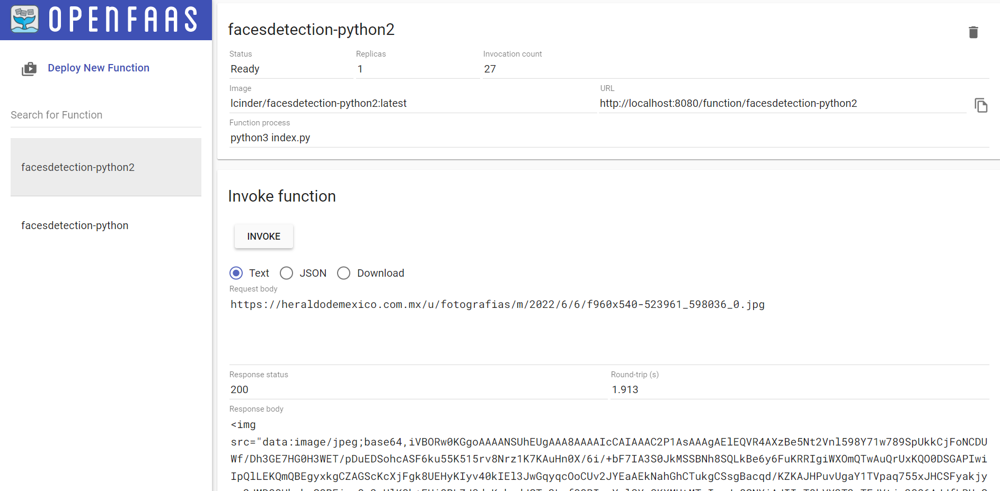


---
